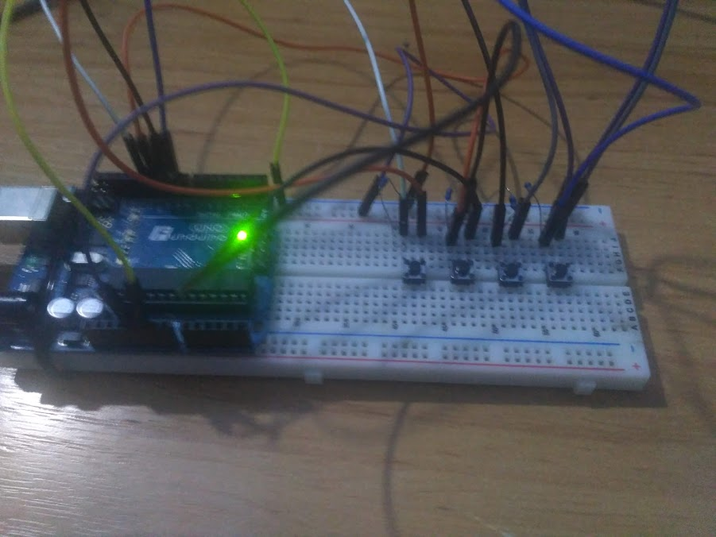

# handless gameboard - a gaming keyboard for (temporary, I hope) handless dudes
You are soo bored and wanna play games but you've got no left hand? No problem, just use your foot to control some key presses!



## requirements
- at least one hand
- arduino
- some resistors
- some buttons
- some wires

## how it works
Arduino sends key events to the *gameboard.py* over serial.
These keys are then mapped to profile-specific mappings and propagated to the system.

```sh
$ ./gameboard.py borderlands2
```

## disclaimer
this prototype has been wired and programmed using single hand
